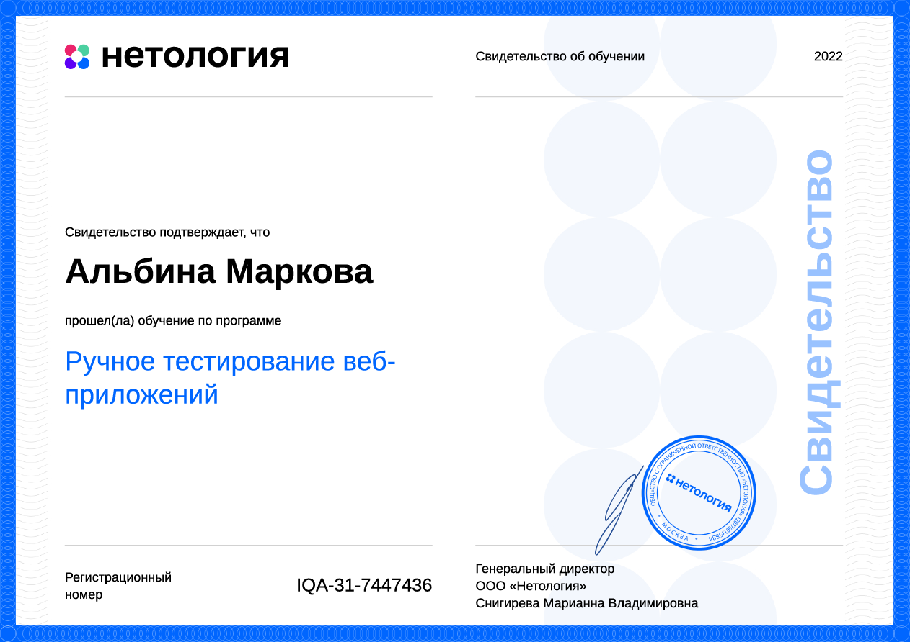

# Ручное тестирование веб-приложений. Учебные проекты в Нетологии.

### Навигация по проектам

1. [Методы и виды тестирования](https://github.com/albinamv/Netology-Manual_testing/blob/main/projects/1.%20TestingTechniques.md)
2. [Артефакты тестирования. Дефекты и отчёты о дефектах](https://github.com/albinamv/Netology-Manual_testing/blob/main/projects/2.%20Test%20artifacts.%20Bug%20reports.md)
3. [Инструменты тестирования для работы с документацией](https://github.com/albinamv/Netology-Manual_testing/blob/main/projects/3.%20Documentation%20testing%20tools/3.%20%20Documentation%20testing%20tools.md)
4. [Написание тест-кейсов к веб-форме](https://github.com/albinamv/Netology-Manual_testing/blob/main/projects/4.%20Test-cases.md)
5. [Жизненный цикл разработки ПО. Выбор методологии для разработки](https://github.com/albinamv/Netology-Manual_testing/blob/main/projects/5.%20Software%20development%20life%20cycle.md)

### Сертификат о прохождении блока
